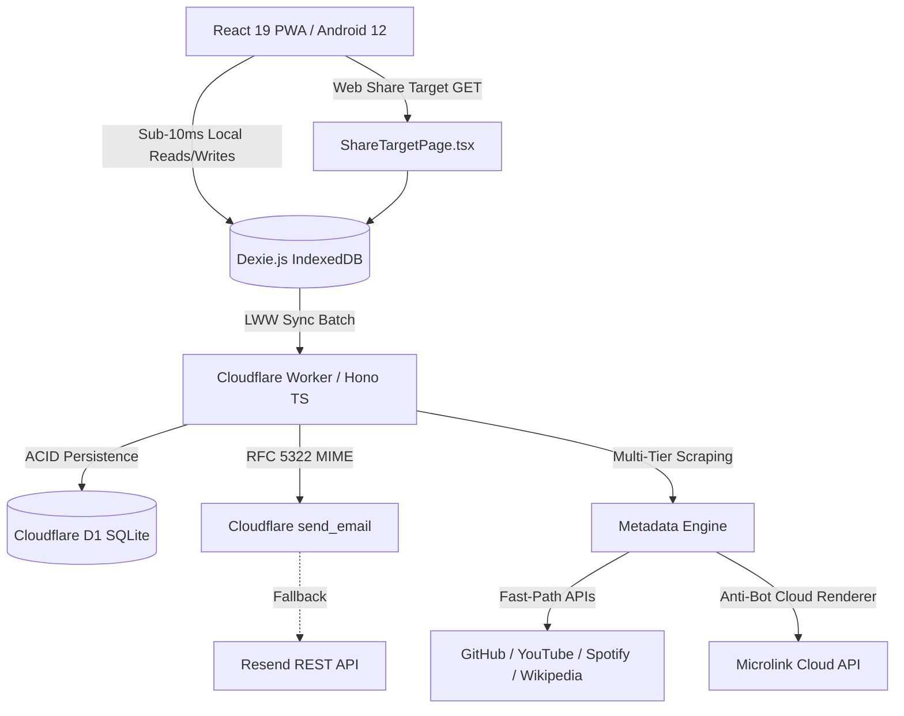

# 🚀 App Blueprints: Production Full-Stack Starter Engine & Snippet Vault

[](https://github.com/belal-waheed/app-blueprints/actions)
[](https://opensource.org/licenses/MIT)
[](https://workers.cloudflare.com)
[](https://react.dev)
[](https://tailwindcss.com)
[-8A2BE2)](llms.txt)

> **App Blueprints** is an open-source full-stack developer knowledge engine and production starter boilerplate kit built with Cloudflare Workers, Hono, React 19, and Tailwind CSS v4 for software engineers and AI coding agents to rapidly scaffold ultra-fast, offline-first, serverless web applications with zero-cost hosting. It provides copy-pasteable architectural snippets, self-contained starter templates, and machine-readable operating runbooks.

---

## ⚡ 1-Click Quick Scaffolding (`degit`)

Clone any self-contained starter blueprint directly into your local workspace with zero boilerplate overhead:

```bash
# 1. 3-Stage Animated Password Recovery & Auth Wizard (Framer Motion + OtpInput + Resend)
npx degit belal-waheed/app-blueprints/templates/auth-recovery-wizard my-auth-app

# 2. Offline-First PWA with Multi-Device LWW Sync & Android 12 Share Target
npx degit belal-waheed/app-blueprints/templates/pwa-offline-sync my-sync-app

# 3. Universal Media & Link Metadata Scraper API (GitHub, Wiki, YouTube, Spotify, Microlink)
npx degit belal-waheed/app-blueprints/templates/universal-media-scraper my-scraper-api

# 4. Headless Microsoft Edge Playwright Test Suite (Back-Button Trapping & Visual Tests)
npx degit belal-waheed/app-blueprints/templates/edge-browser-automation my-edge-tests
```

---

## 📊 Technical Specification & Architecture Matrix

| Architectural Layer | Production Standard | Technology / Protocol | Performance / Benefit |
| :--- | :--- | :--- | :--- |
| **Serverless Compute** | Edge V8 Isolates | [Cloudflare Workers](https://workers.cloudflare.com) (Hono TS) | <5ms cold start, 0ms global routing |
| **Edge Database** | Serverless SQLite | [Cloudflare D1](https://developers.cloudflare.com/d1/) | ACID compliant, zero-config migrations |
| **Frontend Framework** | Modern Component Architecture | [React 19](https://react.dev) + Vite 6 | Sub-100ms HMR, typed JSX |
| **Styling & Tokens** | CSS-First `@theme` Tokens | [Tailwind CSS v4](https://tailwindcss.com) + OKLCH | Zero JavaScript runtime CSS, WCAG AA |
| **Client Storage** | Local-First Database | [Dexie.js](https://dexie.org) 4.x (IndexedDB) | Sub-10ms local reads/writes |
| **Data Synchronization**| Bidirectional Sync | Last-Write-Wins (LWW) + Tombstones | Zero data resurrection, offline resiliency |
| **Transactional Email** | Multipart MIME RFC 5322 | `cloudflare:email` + [Resend API](https://resend.com) | 3-tier delivery fallback |
| **Mobile Integration** | Web Share Target | PWA Manifest (`method: 'GET'`) | Sub-50ms Android 12 Share Sheet Slot #1 |
| **E2E Automation** | Headless Browser Testing | [Playwright](https://playwright.dev) (Microsoft Edge engine) | Zero ad-hoc Chromium downloads |

---

## 🏗️ Architecture Flow



---

## 🤖 AI / LLM Agent First Architecture

This repository is optimized for **AI coding assistants** (Google Antigravity, Claude Code, Cursor, GitHub Copilot, OpenAI Codex) to consume and implement battle-tested patterns with zero hallucination.

| Documentation File | Target Audience | Primary Function |
| :--- | :--- | :--- |
| [`llms.txt`](llms.txt) | LLM Index & Sitemap | Plaintext specification of all modules, APIs, and snippet endpoints |
| [`llms-full.txt`](llms-full.txt) | LLM Context Injection | Unrolled complete context file for single-shot prompt injection |
| [`AGENTS.md`](AGENTS.md) | Autonomous AI Agents | Hard architectural constraints, prompt recipes, and troubleshooting runbook |
| [`PATTERN_TEMPLATE.md`](PATTERN_TEMPLATE.md) | Developers & Contributors | Standardized schema for adding new patterns and snippets |

---

## 📦 Domain-Driven Snippet Vault (`snippets/`)

Copy-paste atomic, zero-dependency, production-grade building blocks:

### 🔐 Authentication & Security (`snippets/auth/`)
- [`pbkdf2-crypto.ts`](snippets/auth/pbkdf2-crypto.ts): Web Crypto API salt generation and PBKDF2 password hashing.
- [`otp-input-component.tsx`](snippets/auth/otp-input-component.tsx): Accessible 6-box segmented OTP component with auto-advance, backspace navigation, and clipboard paste support.
- [`password-strength.ts`](snippets/auth/password-strength.ts): 3-tier password complexity evaluation.

### 📧 Transactional Email Engine (`snippets/email/`)
- [`raw-mime-builder.ts`](snippets/email/raw-mime-builder.ts): RFC 5322 multipart/alternative MIME envelope builder for Cloudflare Workers.
- [`cloudflare-send-email.ts`](snippets/email/cloudflare-send-email.ts): Resilient `new EmailMessage(from, to, rawMime)` dispatcher with Resend fallback.

### ⚡ Offline-First Sync & PWA (`snippets/sync-offline/`)
- [`lww-merge-algorithm.ts`](snippets/sync-offline/lww-merge-algorithm.ts): Deterministic Last-Write-Wins multi-device conflict resolution.
- [`tombstone-delete-handler.ts`](snippets/sync-offline/tombstone-delete-handler.ts): Tombstone record creation and deletion propagation.
- [`broadcast-channel-sync.ts`](snippets/sync-offline/broadcast-channel-sync.ts): Cross-tab real-time reactivity using Web `BroadcastChannel`.

### 🌐 Universal Metadata Scraper (`snippets/scraping/`)
- [`multi-tier-metadata.ts`](snippets/scraping/multi-tier-metadata.ts): High-speed extractors for GitHub, Wikipedia, YouTube, Spotify, Reddit, and AniList.
- [`schema-json-ld-parser.ts`](snippets/scraping/schema-json-ld-parser.ts): OpenGraph, Twitter Card, and Schema.org JSON-LD parser.
- [`microlink-anti-bot-cloud.ts`](snippets/scraping/microlink-anti-bot-cloud.ts): Headless cloud-renderer fallback for 403-protected pages.

### 📱 UI Navigation & Gestures (`snippets/ui-navigation/`)
- [`modal-back-navigation.ts`](snippets/ui-navigation/modal-back-navigation.ts): Traps Android hardware/gesture back buttons to close modals rather than exiting the PWA.
- [`motion-slide-variants.ts`](snippets/ui-navigation/motion-slide-variants.ts): Directional Framer Motion slide & cross-fade transition variants.

---

## ❓ Technical Frequently Asked Questions (FAQ)

<details>
<summary><strong>1. Why does Cloudflare Workers throw a TypeError when sending email?</strong></summary>

Cloudflare's `send_email` binding (`env.Mail_Pass`) requires a raw RFC 5322 multipart MIME envelope passed as `new EmailMessage(from, to, rawMime)`. Passing a JavaScript object directly causes isolate runtime failure. Use [`raw-mime-builder.ts`](snippets/email/raw-mime-builder.ts) to construct the MIME body safely.
</details>

<details>
<summary><strong>2. How do I get my PWA to appear in Slot #1 on Android 12 without clicking "More"?</strong></summary>

Install the PWA on your Android 12 device via Chrome/Edge. Tap **Share** on any link in any app, find your app in the share sheet, **long-press the icon for 1 second**, and tap **"Pin" (📌)**. Your app is now permanently pinned to Slot #1 in the top-left corner across all applications.
</details>

<details>
<summary><strong>3. How does Last-Write-Wins (LWW) prevent deleted items from reappearing?</strong></summary>

When an item is deleted offline, do not remove the record locally. Instead, write a **tombstone** with `isDeleted: true` and an updated timestamp. When syncing, the server and remote clients receive the tombstone and recognize that the deletion is newer than older local edits.
</details>

<details>
<summary><strong>4. Why does is-a.dev reject CNAME records pointing to .workers.dev?</strong></summary>

The `is-a.dev` registry disallows direct CNAME records to `.workers.dev` to prevent subdomain takeovers. In your domain JSON file, specify `"URL": "https://your-app.workers.dev"` to generate a secure HTTP 301 redirect.
</details>

---

## 🛠️ The 3-Part Setup Standard

Every blueprint and template follows a strict 3-part developer experience:
1. **Copyable CLI Command Blocks:** Exact `npx wrangler ...`, `npm install ...` commands.
2. **Annotated `.env.example`:** Fully documented environment variables.
3. **Troubleshooting Matrix:** Direct mapping of platform error codes to verified fixes.

---

## 📜 License

Distributed under the **MIT License**. Free for commercial and personal open-source use.
